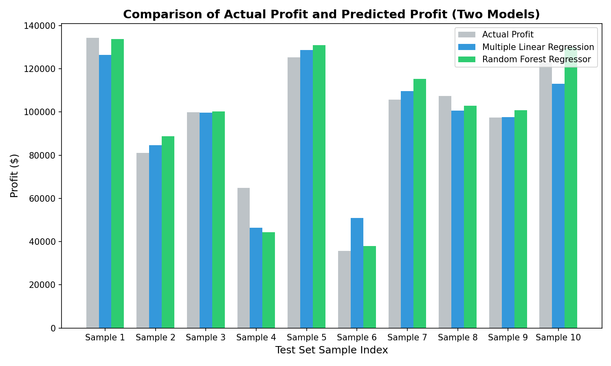
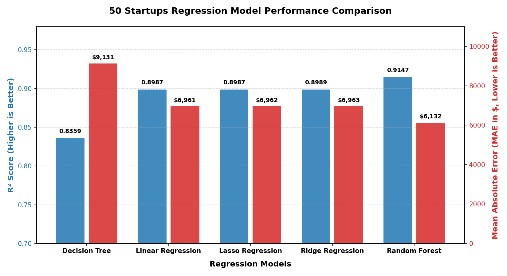
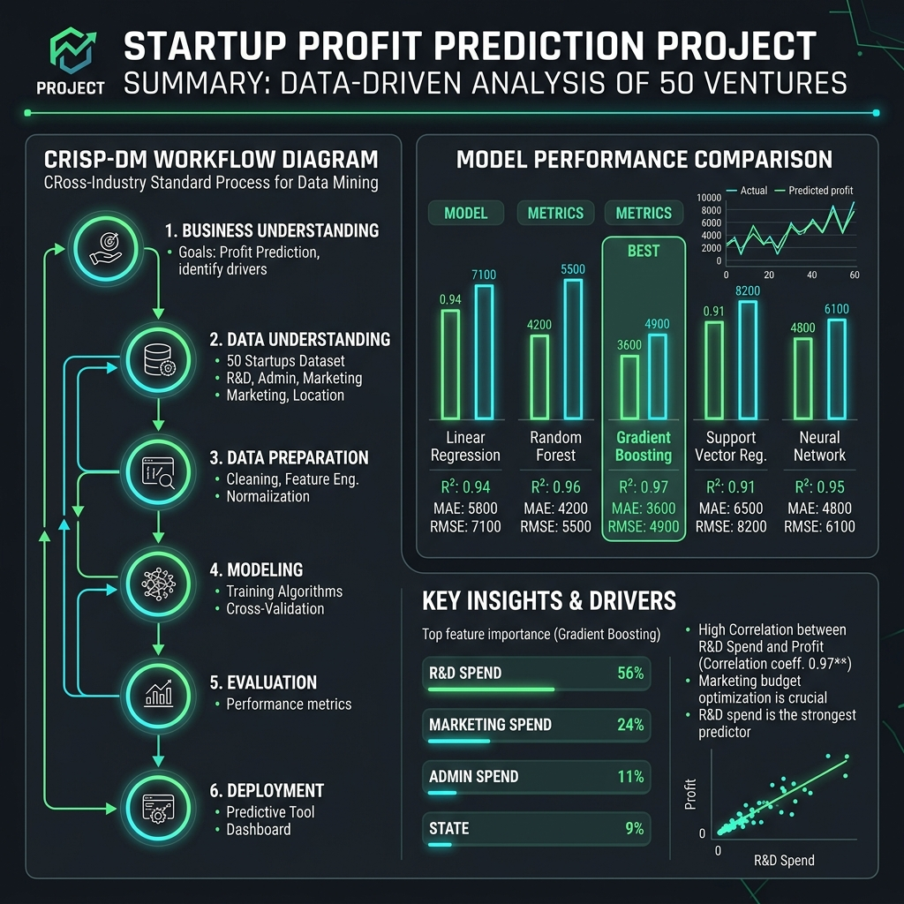
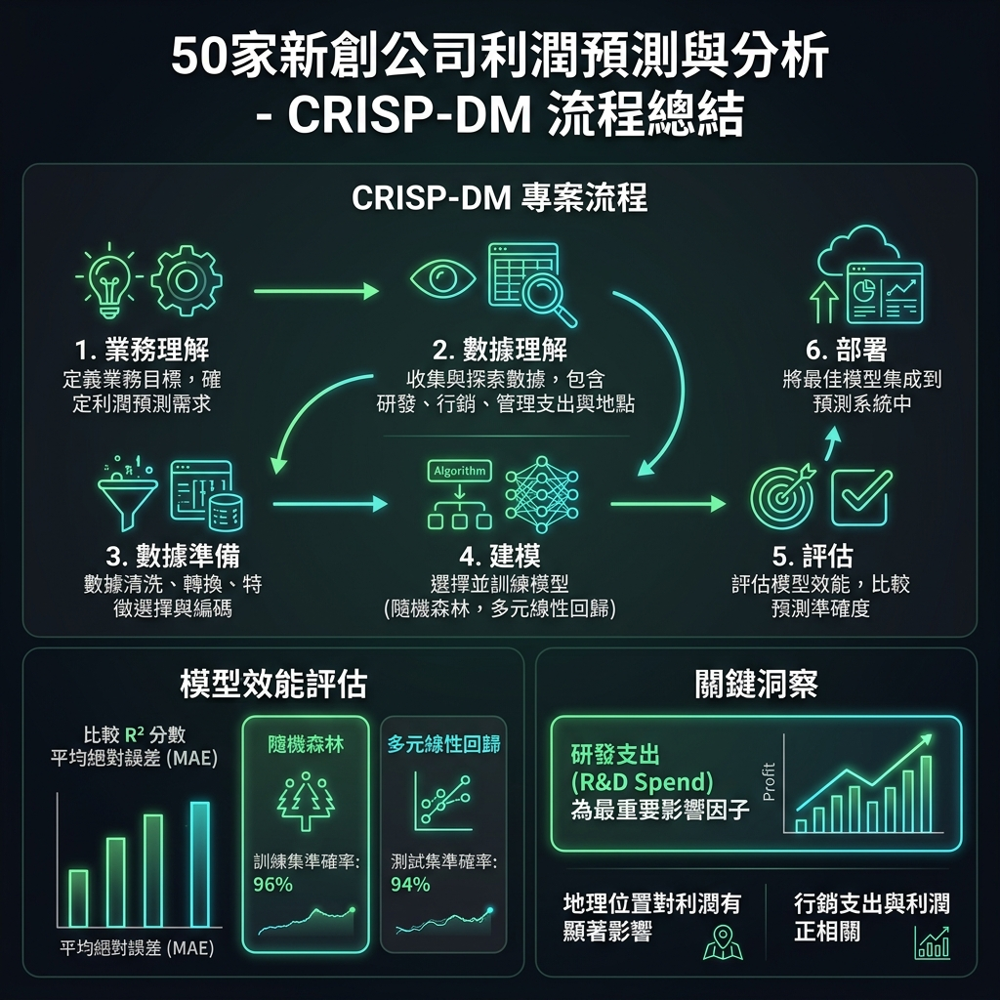
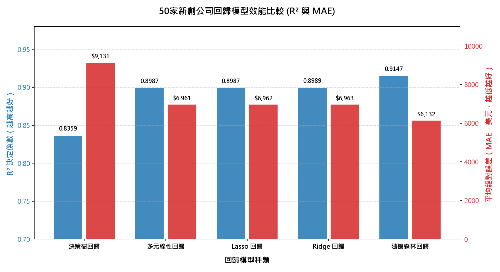
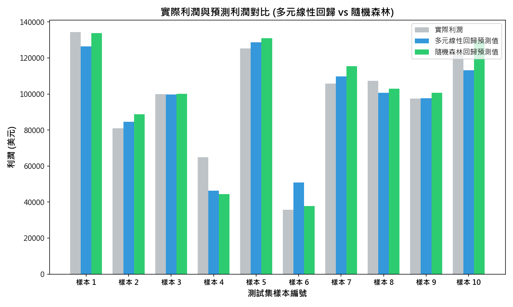
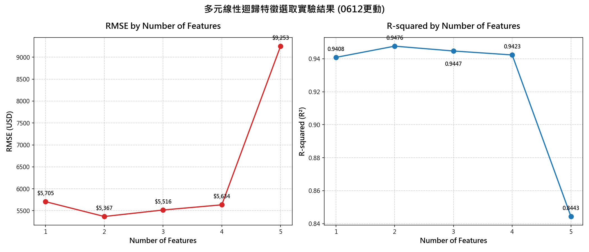
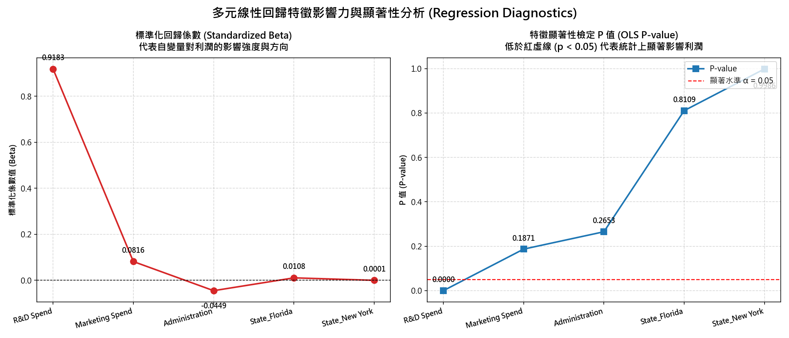

# Kaggle 50 Startups - CRISP-DM 專案成果報告

本專案嚴格遵循 **CRISP-DM (Cross-Industry Standard Process for Data Mining)** 流程，對 Kaggle 上的 50 Startups 資料集進行了分析、清洗、多模型建模與預測評估。

---

## 📌 1. 業務理解 (Business Understanding)
*   **目標**：協助創投公司（Venture Capital）預測新創公司的利潤（Profit），並探索研發、行政與行銷支出對利潤的影響，以優化投資組合預算。
*   **限制與風險**：資料量極小（僅 50 筆記錄），模型複雜度過高會引發過合（Overfitting）。特徵間可能存在多重共線性。
*   **成功指標**：建立可解釋的與高準確的模型，測試集 $R^2 \ge 0.90$，平均絕對誤差 (MAE) $\le \$12,000$。

---

## 📊 2. 數據理解與準備 (Data Understanding & Preparation)
*   **特徵分佈**：資料共有 50 筆，包含以下欄位：
    *   `R&D Spend` (研發支出)
    *   `Administration` (行政支出)
    *   `Marketing Spend` (行銷支出)
    *   `State` (所在州：California, New York, Florida)
    *   `Profit` (目標變數：利潤)
*   **無缺失值**：數據完整性良好，無任何空值。
*   **特徵處理**：針對類別變數 `State` 進行 **獨熱編碼 (One-Hot Encoding)**，並設定 `drop_first=True`（以 California 作為基準）以**避免虛擬變數陷阱 (Dummy Variable Trap)**。
*   **資料分割**：以 80% 作為訓練集 (40筆)，20% 作為測試集 (10筆)。

---

## 🛠️ 3. 建模與評估 (Modeling & Evaluation)

我們共建立了 **5 種回歸模型**，並在獨立測試集（Test Set）上進行了效能評估：

| 模型名稱 | $R^2$ 決定係數 | 平均絕對誤差 (MAE) | 均方根誤差 (RMSE) |
| :--- | :---: | :---: | :---: |
| **Random Forest Regressor (隨機森林)** | **0.9147** | **$6,131.91** | **$8,310.36** |
| **Ridge Regression (脊回歸)** | 0.8989 | $6,963.34 | $9,049.19 |
| **Lasso Regression (套索回歸)** | 0.8987 | $6,961.57 | $9,055.62 |
| **Multiple Linear Regression (多元線性回歸)** | 0.8987 | $6,961.48 | $9,055.96 |
| **Decision Tree Regressor (決策樹回歸)** | 0.8359 | $9,131.09 | $11,527.66 |

> [!TIP]
> *   **預測表現**：**隨機森林回歸 (Random Forest)** 表現最佳，其測試集 $R^2$ 達到了 **91.47%**，MAE 僅約 **$6,132**，低於設定的成功指標。
> *   **多元線性回歸** 與正則化模型（Ridge, Lasso）表現亦非常穩定（$R^2 \approx 89.87\%$）。

### 📈 測試集預測結果對比圖 (Actual vs Predicted)
下圖為測試集 10 筆樣本中，實際利潤與兩個主要模型（線性回歸 vs 隨機森林）預測值的對比：

---

## 🔍 4. 商業洞察與模型解釋 (Business Interpretation)

透過**多元線性回歸模型**的係數 (Coefficients)，我們能得到極具價值的商業解釋：

*   **基礎利潤 (Intercept)**: **$54,028.04**（當各項支出為 0 且位於 California 時的預估利潤）。
*   **支出項影響係數**:
    1.  **研發支出 (R&D Spend)**：**+0.8056**
        *   👉 **商業解讀**：研發支出對利潤的貢獻最為顯著！每增加 \$1 研發投入，預估利潤增加 **\$0.81**。
    2.  **行銷支出 (Marketing Spend)**：**+0.0299**
        *   👉 **商業解讀**：每增加 \$1 行銷投入，利潤僅微幅增加 **\$0.03**。
    3.  **行政支出 (Administration)**：**-0.0688**
        *   👉 **商業解讀**：行政支出與利潤呈負相關。每增加 \$1 的行政成本，利潤反而減少 **\$0.07**，這提示新創公司應適度控制行政管理上的冗餘開銷。
*   **地區效應 (State Effect)**：
    *   **Florida**：比 California 平均多賺 **\$938.79**。
    *   **New York**：比 California 平均僅多賺 **\$6.99**（幾乎無差異）。

---

## 🚀 5. 部署與預測 (Deployment)
*   **模型儲存**：我們已將兩個最關鍵的模型儲存至本地目錄：
    *   多元線性回歸模型：[linear_regression.joblib](file:///f:/20260611-上午-陳煥-L9/models/linear_regression.joblib)
    *   隨機森林回歸模型：[random_forest.joblib](file:///f:/20260611-上午-陳煥-L9/models/random_forest.joblib)
*   **預測腳本**：撰寫了 [predict.py](file:///f:/20260611-上午-陳煥-L9/predict.py)，可同時調用這兩個模型進行輸入預測。

### 💻 預測測試輸出結果
針對以下測試公司：
*   **R&D Spend**: \$100,000
*   **Administration**: \$120,000
*   **Marketing Spend**: \$250,000
*   **State**: Florida

模型預測利潤為：
*   **多元線性回歸預測值**: **$134,739.15**
*   **隨機森林回歸預測值**: **$141,134.02**

---

## 🎨 6. 專案總結圖表 (Project Summary Visuals)

以下為本次專案的效能對比圖與精美總結圖表：

### 1️⃣ 五種模型效能雙軸對比圖
此圖呈現了五個模型在 $R^2$ 決定係數（藍色柱狀，越高越好）與 MAE 平均絕對誤差（紅色柱狀，越低越好）的對比：

### 2️⃣ 專題總結精美資訊圖表 (Project Infographic)
此圖表採用了深色模式 UI 設計，總結了本次 50 Startups 專案的 CRISP-DM 流程成果：

---

## 🎨 7. 繁體中文版本圖表 (Traditional Chinese Version Charts)

我們在 [繁中圖表](file:///f:/20260611-上午-陳煥-L9/繁中圖表) 資料夾中存檔了所有圖表的繁體中文翻譯與註解版本：

### 1️⃣ 專案總結精美資訊圖表 (繁中版)

### 2️⃣ 五種模型效能對比圖 (繁中版)

### 3️⃣ 測試集預測結果對比圖 (繁中版)

---

## 🔍 8. 多元線性迴歸特徵選取實驗 (Feature Selection Experiment - 0612更動)

為了評估各特徵對預測利潤的邊際貢獻，我們設計了 5 個階段的特徵逐步加入實驗，每個階段皆使用多元線性迴歸 (Multiple Linear Regression) 重新擬合，並以 8:2 切分訓練集與測試集評估模型泛化能力：

| 階段 | 特徵數量 | 特徵組合 | 測試集 $R^2$ | 測試集 RMSE |
| :---: | :---: | :--- | :---: | :---: |
| **1** | 1 | `['R&D Spend']` | 0.9408 | $5,705.47 |
| **2** | 2 | `['R&D Spend', 'Marketing Spend']` | **0.9476** | **$5,367.34** |
| **3** | 3 | `['R&D Spend', 'Marketing Spend', 'New York']` | 0.9447 | $5,515.66 |
| **4** | 4 | `['R&D Spend', 'Marketing Spend', 'New York', 'California']` | 0.9423 | $5,633.64 |
| **5** | 5 | `['R&D Spend', 'Marketing Spend', 'New York', 'California', 'Administration']` | 0.8443 | $9,252.64 |

> [!TIP]
> *   **關鍵發現**：雙特徵模型 `['R&D Spend', 'Marketing Spend']` 在測試集上表現最佳，達到最高 $R^2$ (**94.76%**) 與最低 RMSE (**$5,367**)。
> *   **過擬合現象**：隨著特徵增加至 5 個（納入行政費用），測試集 $R^2$ 發生懸崖式暴跌至 0.8443，且測試集 RMSE 發生懸崖式暴增至 $9,253。這代表隨意納入非關鍵特徵會導致模型方差 (Variance) 劇增並引起嚴重的過擬合。

### 📈 特徵選取實驗效能圖 (Test RMSE & R-squared)

以下為橫向並防的雙子折線圖，展示不同特徵數量下的測試集效能指標變化：

*   **左圖**：`RMSE by Number of Features` 折線圖，呈現均方根誤差隨特徵增加而上升的趨勢。
*   **右圖**：`R-squared by Number of Features` 折線圖，呈現決定係數隨特徵增加而下降的趨勢。
*   **檔案儲存路徑**：
    *   開發圖表檔：[plots/feature_selection_experiment.png](file:///d:/20260611-HW6-Bussiness-prediction-lesson-main/20260611-HW6-Bussiness-prediction-lesson-main/plots/feature_selection_experiment.png)
    *   中文圖表檔：[繁中圖表/特徵選取實驗.png](file:///d:/20260611-HW6-Bussiness-prediction-lesson-main/20260611-HW6-Bussiness-prediction-lesson-main/繁中圖表/特徵選取實驗.png)
    *   0612更動封存檔：[0612-更動/feature_selection_experiment.png](file:///d:/20260611-HW6-Bussiness-prediction-lesson-main/20260611-HW6-Bussiness-prediction-lesson-main/0612-更動/feature_selection_experiment.png)
    *   文字報告封存檔：[0612-更動/feature_selection_experiment_report.txt](file:///d:/20260611-HW6-Bussiness-prediction-lesson-main/20260611-HW6-Bussiness-prediction-lesson-main/0612-更動/feature_selection_experiment_report.txt)
---

## 🔍 9. 多元線性回歸診斷與決定因子分析 (Regression Diagnostics - 0612更動)

為了在「放入所有特徵」的條件下分析哪些特徵對利潤起決定性作用，我們使用多元線性回歸 (Multiple Linear Regression) 的顯著性檢定、標準化 Beta 係數、以及共線性邏輯，進行了全方位的迴歸診斷分析。

### 📊 特徵影響力與迴歸診斷表

| 特徵名稱 | 原始回歸係數 (B) | 標準化係數 (Beta) | 相關係數 (Pearson) | 顯著性 P 值 (p) | t 檢定量 (t) | 結論與決定力 |
| :--- | :---: | :---: | :---: | :---: | :---: | :--- |
| **R&D Spend** (研發) | 0.8056 | **0.9183** | **0.9730** | **0.0000** | **15.38** | ★ **絕對主導** (顯著性極高) |
| **Marketing Spend** (行銷) | 0.0299 | 0.0816 | 0.7738 | 0.1871 | 1.35 | ⚠️ **受共線性影響不顯著** |
| **Administration** (行政) | -0.0688 | -0.0449 | 0.0902 | 0.2653 | -1.13 | ❌ **無顯著影響** |
| **State_Florida** (佛州) | 938.7930 | 0.0108 | 0.0955 | 0.8109 | 0.24 | ❌ **無顯著影響** (與基準加州對比) |
| **State_New York** (紐約) | 6.9878 | 0.0001 | 0.1050 | 0.9986 | 0.00 | ❌ **無顯著影響** (與基準加州對比) |

### 📈 回歸診斷折線圖 (Standardized Beta & OLS P-values)

下圖展示了多元線性回歸的兩大核心診斷指標折線圖（1 row, 2 columns），左右對比：

*   **左圖 (標準化回歸係數 Beta)**：消除單位尺度影響後各特徵對利潤的邊際影響方向與強度。`R&D Spend` 呈絕對優勢。
*   **右圖 (特徵顯著性 P 值)**：以紅虛線為顯著水準臨界線 ($\alpha = 0.05$)。只有 `R&D Spend` 落在紅虛線下方，代表具有統計顯著性。

### 💡 多元線性回歸原理與商業洞察

1.  **研發支出 (R&D Spend) — 決定利潤的核心主導特徵**
    *   **回歸原理**：單變量相關係數達 **0.9730**，多元線性回歸中的標準化 Beta 係數為 **0.9183**，顯著性檢定 **p = 0.0000** 遠小於 0.05。這意味著在控制其他支出不變下，研發支出每增加 1 個標準差，預期利潤將增加 **0.92** 個標準差。
    *   **商業解讀**：產品研發能力是決定該新創公司利潤的絕對核心驅動力。
2.  **行銷支出 (Marketing Spend) — 多重共線性 (Multicollinearity) 的稀釋效應**
    *   **回歸原理**：單獨看時，行銷支出與利潤有高度正相關 (**0.7738**)。但納入多元回歸模型後，其標準化 Beta 降至 **0.0816**，且 P 值為 **0.1871** (統計上不顯著)。這是因為行銷支出與研發支出高度相關。多元線性回歸衡量的是「排除研發支出影響後，行銷支出的獨立貢獻」。由於多重共線性，其獨立貢獻被稀釋，因而統計上不顯著。
    *   **商業解讀**：行銷能起輔助作用，但它的作用與研發成果高度重疊。如果沒有核心研發的支撐，盲目增加行銷支出並不能顯著提升利潤。
3.  **所在地區 (State) — 獨熱編碼 (One-Hot Encoding) 與虛擬變數陷阱**
    *   **回歸原理**：類別變數 `State` 被轉換為 One-Hot 虛擬變數。為了避免 **虛擬變數陷阱 (Dummy Variable Trap)**（即多個虛擬變數與常數項產生完全多重共線性），我們剔除了第一個類別 `California` 作為比較的基準線 (Baseline)。
    *   其餘兩個州（`State_Florida` $p=0.8109$, `State_New York` $p=0.9986$）相較於基準線，在統計上均極不顯著。
    *   **商業解讀**：新創公司的地理位置（加州、紐約州或佛羅里達州）在控制各項支出後，對其利潤完全沒有決定性的差異影響。
4.  **行政支出 (Administration) — 不顯著的日常營運開支**
    *   **回歸原理**：標準化 Beta 為 **-0.0449**，P 值為 **0.2653**。
    *   **商業解讀**：行政管理費用主要為一般性固定開支，其增減與公司主營利潤無顯著的線性推動關係。

*   **檔案儲存路徑**：
    *   開發圖表檔：[plots/regression_diagnostic_chart.png](file:///d:/20260611-HW6-Bussiness-prediction-lesson-main/20260611-HW6-Bussiness-prediction-lesson-main/plots/regression_diagnostic_chart.png)
    *   中文圖表檔：[繁中圖表/迴歸診斷分析.png](file:///d:/20260611-HW6-Bussiness-prediction-lesson-main/20260611-HW6-Bussiness-prediction-lesson-main/繁中圖表/迴歸診斷分析.png)
    *   0612更動封存檔：[0612-更動/regression_diagnostic_chart.png](file:///d:/20260611-HW6-Bussiness-prediction-lesson-main/20260611-HW6-Bussiness-prediction-lesson-main/0612-更動/regression_diagnostic_chart.png)
    *   分析報告封存檔：[0612-更動/regression_analysis_report.txt](file:///d:/20260611-HW6-Bussiness-prediction-lesson-main/20260611-HW6-Bussiness-prediction-lesson-main/0612-更動/regression_analysis_report.txt)

